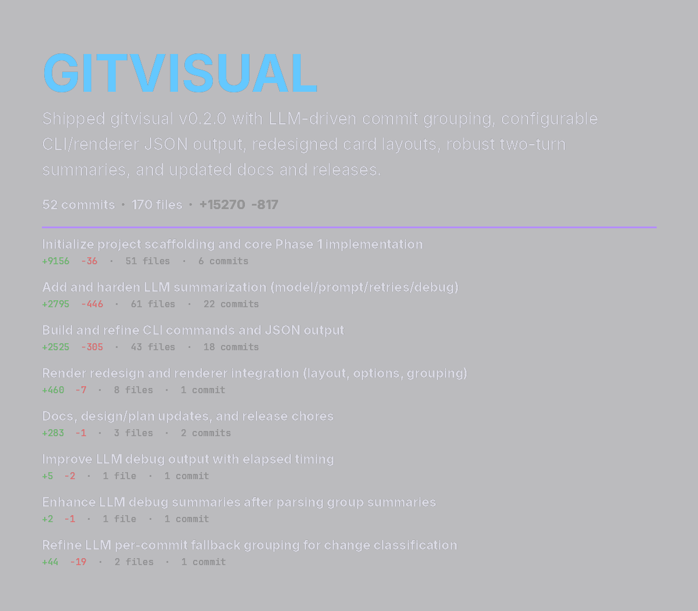

# gitvisual

Generate beautiful visual cards from git commit history — PNG infographics suitable for daily collages, portfolio snapshots, or just keeping a record of your work.



## What it does

`gitvisual` reads your git history and renders a clean, dark-themed PNG card per repository for a given date range or day. Each card shows:

- Repo name and date
- Aggregate stats: commits, files changed, insertions, deletions
- Per-commit rows: short hash, message, ±stats, touched files
- Optional one-sentence LLM narrative summary of the day's work

The output is a portable PNG — drop it into a daily photo collage, a Notion page, or just archive it.

## Install

Requires Python 3.12+. Install with [uv](https://github.com/astral-sh/uv):

```bash
uv tool install gitvisual
```

Or install from source:

```bash
git clone https://github.com/yourname/gitvisual
cd gitvisual
uv sync
uv run gitvisual --help
```

## Usage

### Generate a card

```bash
# Today's activity in a single repo
gitvisual generate ./my-repo

# A specific date
gitvisual generate ./my-repo --date 2025-04-07

# Yesterday (shortcut)
gitvisual generate ./my-repo --yesterday

# Multiple repos at once
gitvisual generate ./repo1 ./repo2 --date 2025-04-07

# A date range
gitvisual generate ./repo1 --from 2025-04-01 --to 2025-04-07

# Last 7 days
gitvisual generate ./repo1 --last-week

# Control output location and style
gitvisual generate ./repo1 --output ./cards/ --style detailed

# Enable LLM narrative summary (opt-in)
gitvisual generate ./repo1 --summarize
```

### Discover active repos

Scan a directory tree for repos that had commits on a given date:

```bash
gitvisual discover ~/Documents/Projects --date yesterday

# Discover and generate cards in one step
gitvisual discover ~/Documents/Projects --yesterday --generate --output ~/daily-cards/
```

### Manage config

```bash
gitvisual config init   # Write a default config.toml to ~/.config/gitvisual/
gitvisual config show   # Print the resolved config
```

## Card styles

| Style | Description |
|---|---|
| `compact` | File list capped; clean summary view. Good for collages. |
| `detailed` | All files shown; no truncation. Better for archiving. |

## LLM summaries (optional)

LLM summaries are **off by default** to avoid accidental API calls. Enable per-run with `--summarize`, or set `summarize = true` in your config.

Supports any model via [litellm](https://github.com/BerriAI/litellm): OpenRouter, OpenAI, Anthropic, Ollama, etc.

## Configuration

Config lives at `~/.config/gitvisual/config.toml`. Run `gitvisual config init` to generate a starter file.

```toml
[defaults]
output_dir = "."
theme = "dark"
style = "compact"
summarize = false       # opt-in; avoids accidental LLM calls

[llm]
provider = "openrouter"
model = "anthropic/claude-3-haiku"
api_key_env = "OPENROUTER_API_KEY"   # env var name to read the key from
max_tokens = 200
timeout = 30

[render]
card_width = 1200
min_card_height = 1200
padding = 60
max_files_shown = 12

[repos]
scan_dirs = []
exclude = ["node_modules", "vendor", ".cache", "dist", "build"]

[theme]
background = "#1e1e28"
text       = "#dcdce6"
heading    = "#64c8ff"
added      = "#64c864"
removed    = "#ff6464"
accent     = "#b48cff"
muted      = "#969696"
subheading = "#c8a0ff"
```

Every command works with no config file present — all values have built-in defaults.

## Daily collage workflow

The tool was built for an image-a-day collage project. The intended end-of-day workflow:

```bash
gitvisual discover ~/Projects --date today --generate --output ~/daily-cards/
```

This finds every repo with commits today, renders one PNG per repo, and puts them in `~/daily-cards/`. Pull those into your collage tool alongside photos, sketches, etc.

Cards are designed to look good at reduced size: high contrast, no tiny text, soft 1:1 aspect ratio that expands vertically with content.

## Visual design

- Dark background `#1e1e28`, light text `#dcdce6`
- Headings in blue `#64c8ff`, additions in green, removals in red, accents in purple
- Bundled fonts: [Inter](https://rsms.me/inter/) for body/headings, [JetBrains Mono](https://www.jetbrains.com/lp/mono/) for hashes and stats (both OFL licensed)
- Output: RGBA PNG, 1200px wide by default

## Roadmap

- **Phase 1** (current): Polished data cards — one PNG per repo per day
- **Phase 2**: Chart components — contribution heatmap, bar charts, file treemap, language breakdown donut
- **Phase 3**: Dashboard layouts — multi-chart composites, weekly/monthly summaries, combined multi-repo cards

## Development

```bash
uv sync
uv run pytest
uv run ruff check src/ tests/
uv run mypy src/
make ci          # full gate: lint → typecheck → tests
```

## License

MIT
